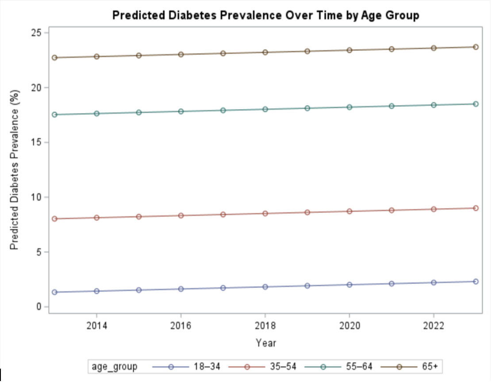
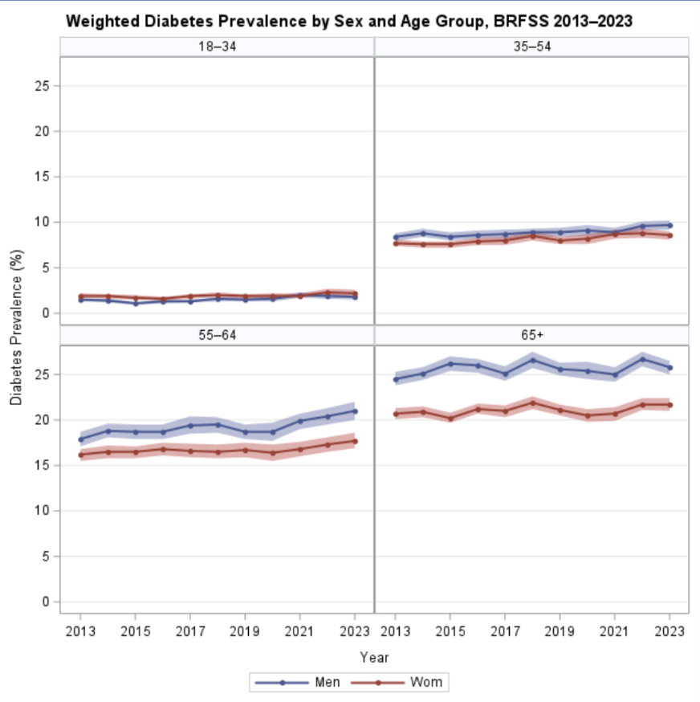
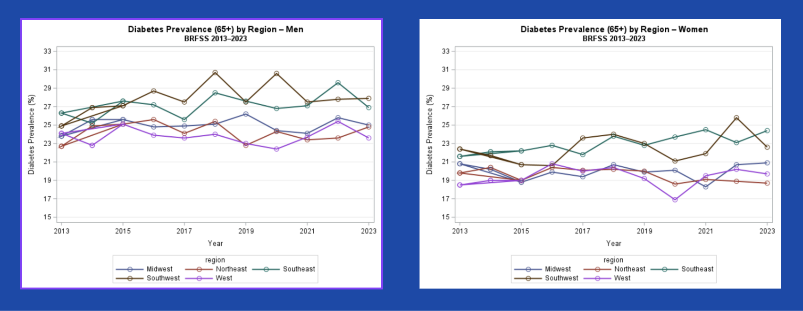

# Assessing Temporal Shifts in U.S. Diabetes Prevalence
## A Stratified Time-Series Analysis, 2013–2023

**Tools:** SAS 9.4 · Survey-weighted analysis · Time-series regression  
**Data:** BRFSS (CDC) · ~400,000 respondents/year · 11 annual datasets  
**Skills demonstrated:** SAS macro development · ETL pipeline design · 
complex survey analysis · multivariable regression · data visualization

---

## Overview

Diabetes affects more than 38 million U.S. adults and continues to rise,
but national estimates often mask meaningful variation across demographic 
and geographic subgroups. This project examines temporal trends in 
diagnosed diabetes prevalence from 2013 to 2023 using the Behavioral Risk 
Factor Surveillance System (BRFSS), stratified jointly by age group, sex, 
and U.S. census region.

This was completed as a graduate-level advanced data analysis project at 
Tufts University (Fall 2025).

---

## Research questions

1. How has U.S. diabetes prevalence changed from 2013 to 2023?
2. Do temporal trends differ by age group, sex, or geographic region?
3. Have demographic and regional disparities widened, narrowed, or 
   remained stable over this period?

---

## Data

- **Source:** CDC Behavioral Risk Factor Surveillance System (BRFSS)
- **Years:** 2013–2023 (11 annual cross-sections)
- **Sample:** ~400,000+ respondents per year (publicly available)
- **Access:** https://www.cdc.gov/brfss/data_documentation/index.html

Raw data are not stored here. See `/data/data_source.md` for download 
instructions and `/docs/data_dictionary.md` for variable definitions 
and recoding decisions.

---

## Methods

**Study design:** Repeated cross-sectional time-series analysis

**Data processing:** Annual BRFSS SAS transport files were imported, 
cleaned, and harmonized using a custom SAS macro (see `/code`). The macro 
standardizes variable recoding, applies exclusion criteria, and outputs 
an analysis-ready dataset for each survey year — enabling consistent, 
reproducible processing across all 11 years and ~4.4 million total 
observations.

**Analysis:**
- Survey-weighted prevalence estimated annually for each 
  sex × age group × region stratum using PROC SURVEYMEANS
- Four nested OLS regression models fit on annual weighted prevalence 
  percentages to quantify temporal trends
- Year centered at 2013 (year_c = year − 2013) to improve interpretability
- Models adjusted sequentially for sex, age group (18–34, 35–54, 55–64, 
  65+), and region (Northeast, Southeast, Midwest, Southwest, West)

**Software:** SAS 9.4

---

## Key findings

- Diabetes prevalence increased by approximately **0.10 percentage points 
  per year** across all models (β = 0.097, p < 0.001 in fully adjusted model)
- **Men** had consistently higher prevalence than women (~1.95 pp higher), 
  a difference stable across all model adjustments
- **Age** was the strongest predictor: adults ≥65 had prevalence more than 
  21 percentage points higher than adults 18–34
- **Southeast and Southwest** carried the highest regional burden (~2.2–2.5 
  pp above Northeast reference), consistent with the documented "diabetes belt"
- Temporal trends were parallel across all subgroups — disparities are 
  persistent but not widening

---

## Visualizations

**Figure 1** — Predicted prevalence over time by age group (Model 4)

**Figure 2** — Weighted diabetes prevalence stratified by sex and age group, 2013–2023

**Figure 3** — Predicted prevalence over time by U.S. region (Model 4)

---

## How to reproduce

1. Download BRFSS SAS transport files for years 2013–2023 from the CDC 
   (see `/data/data_source.md`)
2. Update the file path macro variable at the top of 
   `brfss_cleaning_macro.sas`
3. Run `brfss_cleaning_macro.sas` to process and stack all annual datasets
4. Run `brfss_analysis.sas` to generate weighted prevalence estimates, 
   regression models, and figures

---

## Author

**Olivia Wallen**  
MS, Nutrition Epidemiology and Data Science · Tufts University (2026)  
[LinkedIn](https://www.linkedin.com/in/olivia-wallen/) · [Email](mailto:oliviawallenn@gmail.com)
